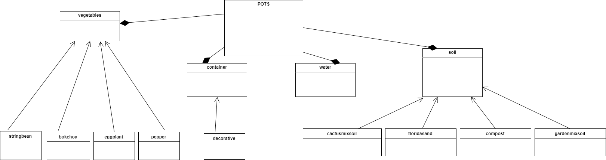
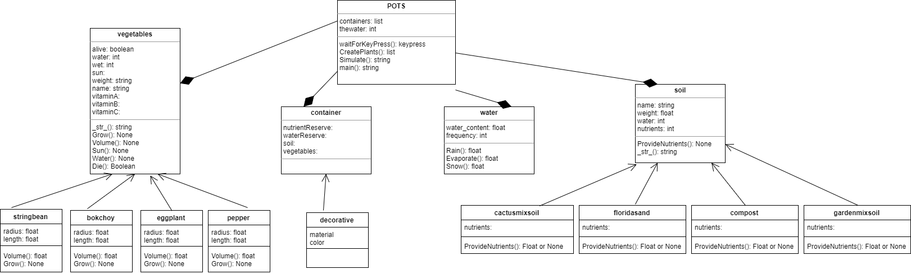

## **P**ortable **O**rganic **T**rouble-free **S**elf-watering System (**POTS**) Model

#####Object Diagram of POTS

#####Class Diagram of POTS

POTS has water, vegetables, soil, and container classes.Stringbean, bokchoy, eggplant, pepper are a vegetable. Decorative is a container. Floridasand, compost, cactusmix soil, and garden mix soil are a soil.

You kill your plants after a key timesteps, but you could always add nuterients
from compost and add more water and tweak it based on measured constants to simulate
a real system)

