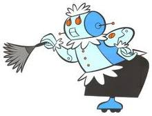
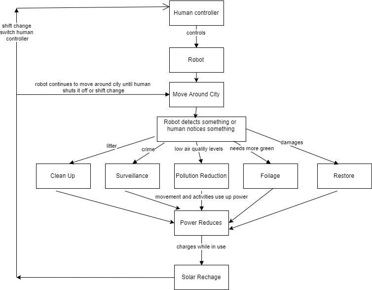

## Smart City (My Problem) Model - Behavior Diagram

The human controls the robot. In order to help reduce the crime, trash, and pollution the robot detects something and/or the human notices something with the robot's camera and audio.

Source: http://www.robots-and-androids.com/images/RosieCleaning.png

The human then fixes the problem based on the condition. Moving around the city and the clean up, surveillance, pollution reduction, foilage, and restore features use up power. The robot charges while in use. The human continues to control the robot until they decide to shut off the robot. Different people can control the robot. 

