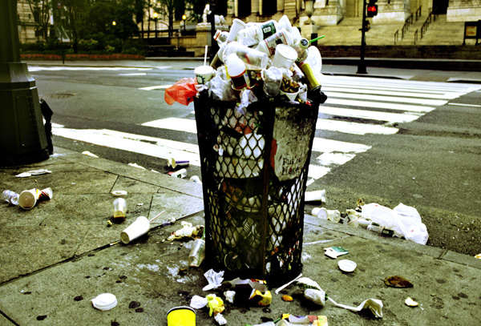
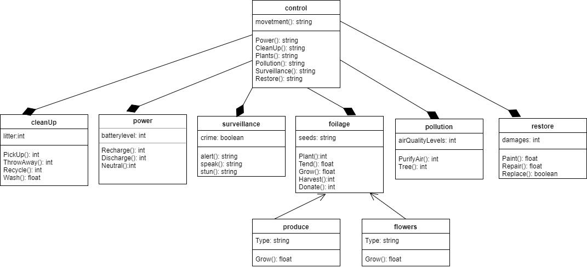

## Smart City (My Problem) Model - Class Diagram

The class diagram describes the operations of the robot. 

The class diagram has 9 classes.

Control class has a cleanUp, power, surveillance, foilage, polution, and restore classes. Porduce and flowers are foilage. 