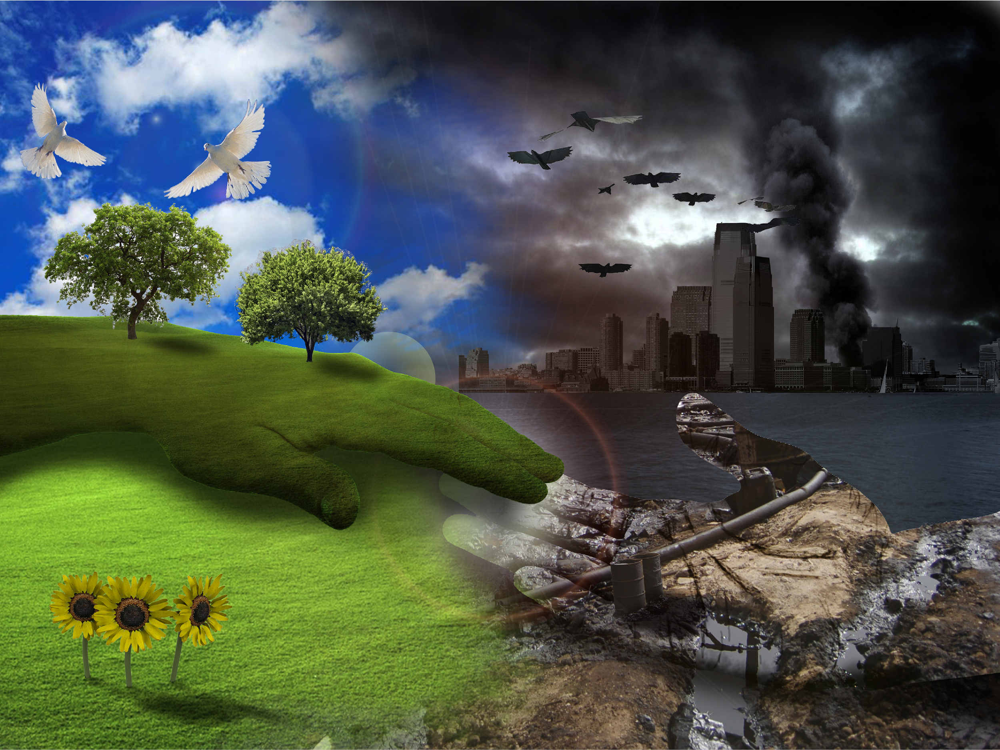
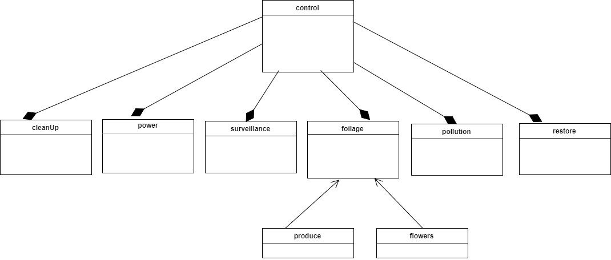

## Smart City (My Problem) Model - Object Diagram

This diagram contains the objects control, cleanUp, power, surveillance, foilage, pollution, restore, produce, and flowers. 

Source: https://media.defense.gov/2011/Mar/07/2000279938/-1/-1/0/110307-F-PO994-001.JPG

The object diagram has 9 classes. 

Control class has a cleanUp, power, surveillance, foilage, polution, and restore classes. Porduce and flowers are foilage. 